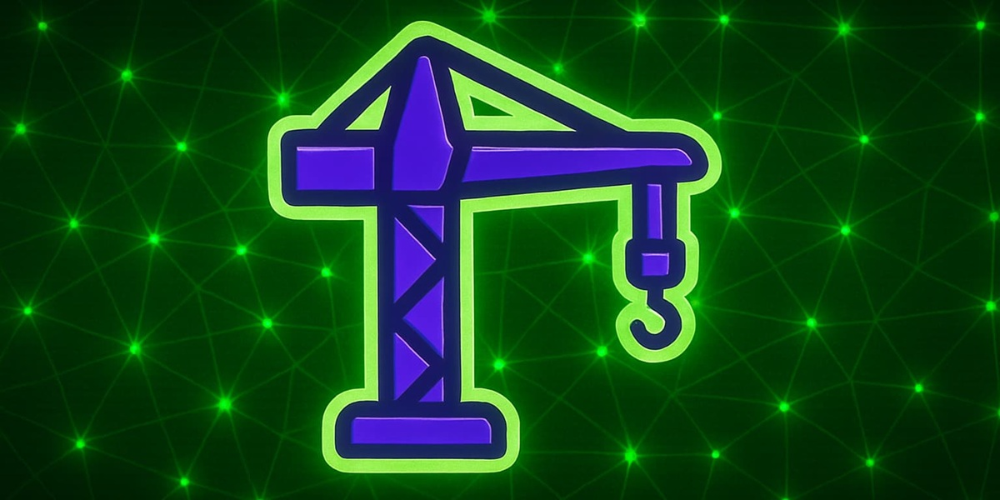

# 🟢 Catalogue – Template GitHub

## 🎯 Objectif du projet

Ce catalogue est un dépôt-template permettant à chacun·e de devenir son propre média numérique.

* Possibilité de personnaliser le `manifest.json` avec ses propres contenus (ex : articles, images, PDFs, etc.) ou repartir de ceux proposés.
* Le projet est conçu pour apprendre en construisant : on déploie simultanément les nouveautés et les tests (bêtas), dans une approche itérative pour faciliter l’adhésion progressive.
* Le projet s’appuie sur une approche d’éducation populaire et d’empouvoirement par le numérique 



## 📦 Contenu du projet

```text
/css         → fichiers CSS (style)
/images      → visuels à afficher
/md          → fichiers Markdown (contenus)
/pdfs        → documents PDF
/scripts     → scripts JavaScript, ex. validate.html
/thumbs      → vignettes/stubs d'aperçu
/zips        → archives compressées (“downloads”)
/index.html  → page d'accueil du catalogue dynamique
/manifest.json → configuration des contenus affichés
```

## ⚙️ Fonctionnement technique

* **Deux fichiers essentiels** :

  * `index.html` : génère la page en fonction des entrées du manifest
  * `manifest.json` : liste les contenus à inclure (titres, chemins, types…)

* **Aucune infrastructure complexe** : le template se déploie facilement sur n’importe quel hébergement simple (GitHub Page, Netlify, etc.).

* **Pas de prestation technique garantie** : mais ouverture totale aux contributions, issues ou échanges via GitHub si besoin.

## 🚀 Démo en ligne

Le catalogue est consultable en live ici :
[dl.ouaisfi.eu](https://dl.ouaisfi.eu/)

## 🛠 Installation & usage

1. Forker ou cloner ce dépôt.
2. Modifier `manifest.json` pour y indiquer **ses contenus** :

   * `"title"`, `"type"`, `"path"`, etc.
3. Placer les fichiers dans les dossiers correspondants (`thumbs/`, `pdfs/`, etc.).
4. Ouvrir `index.html` dans un navigateur ou déployer sur un serveur statique.
5. Observer son catalogue personnalisé en ligne.

## 🌱 Bonnes pratiques pédagogiques

* Travail en **version bêta** : ajouter progressivement de nouveaux modules / tests.
* Approche **itérative et évolutive** : permettre aux personnes de prendre en main à leur rythme, et d'améliorer le projet progressivement.

## 📜 Licence

* **Tout est permis sauf utilisation commerciale.**
* Citation de la source appréciée, mais **pas obligatoire**.
* Usage simple / libre-service : adapter, modifier, partager.


---


